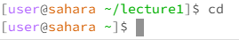
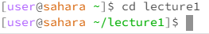
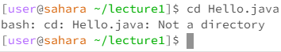
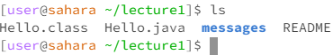
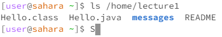
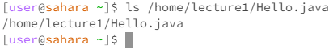
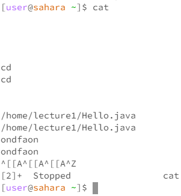
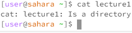
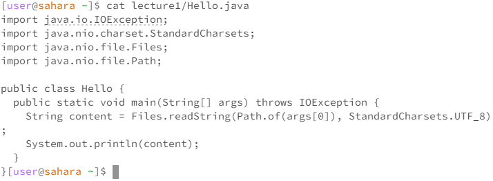

Chao, world!

`cd`:

 

cd blank:
 

 
This returns the working directory to home, if the working directory is at home, then nothing happens.

cd dir:
 

 
Sets the current working directory to the directory specified if it is in the current working directory, otherwise an error is thrown stating that the directory doesn't exist.

cd file: 
 

 
This is an error, the change directory command can't change into a file as it isn't a directory and therefore doesn't have the same commands.

 

`ls`:

 

ls blank: 
 

 
Creates a list of everything in the current working directory.
    
ls dir: 
 

 
If using an absolute class, the ls command will make a list of everything in the specified directory.
    
ls file: 
 

 
List the absolute path of the file.

 

`cat`:

 

cat blank:
 

 
Breaks the line unless you use Ctrl+Z to stop the function
    
cat dir: 
 

 
Error cat can't list out the contents of the file as the list command does that. The cat command is for files and the ls command is for directories. 

cat file: 
 

 
spells out the contents of the file in the command line.
