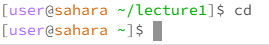
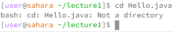
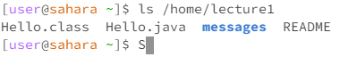

## Lab Report 1

`cd`:

cd blank:
 

 
This is not an error. This returns the working active directory to the home directory, which in this case is /home/, if the active working directory is already at the home directory, then nothing visible happens.

cd dir:
 

 
This is not an error. Sets the current working directory to the directory specified if it is in the current working directory, otherwise an error is thrown stating that the directory doesn't exist.

cd file: 
 

 
This is an error, the change directory command can't change into a file as it isn't a directory and therefore doesn't have the same commands.

 

`ls`:

ls blank: 
 

 
This is not an error. Prints out a list of everything inside the current working directory on the command line.
    
ls dir: 
 

 
This is not an error. If using an absolute class, the ls command will make a list of everything in the specified directory.
    
ls file: 
 

 
This is not an error. Prints out the absolute path of the file on the command line.

 

`cat`:

cat blank:
 

 
This is not an error, but the input is most likely not what the user wanted. The command line ceases to take commands and prints out all inputs from the keyboard until the command is terminated (Ctrl-Z)
    
cat dir: 
 

 
This is an error, cat can't list out the contents of the file as the list command does that. The cat command is for files and the ls command is for directories. 

cat file: 
 

 
This is not an error. Spells out the contents of the file in the command line.
