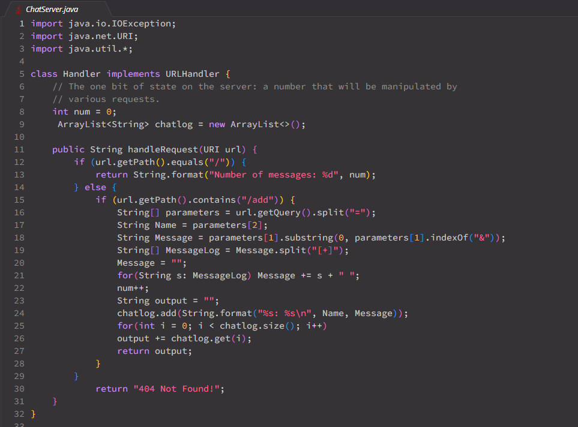
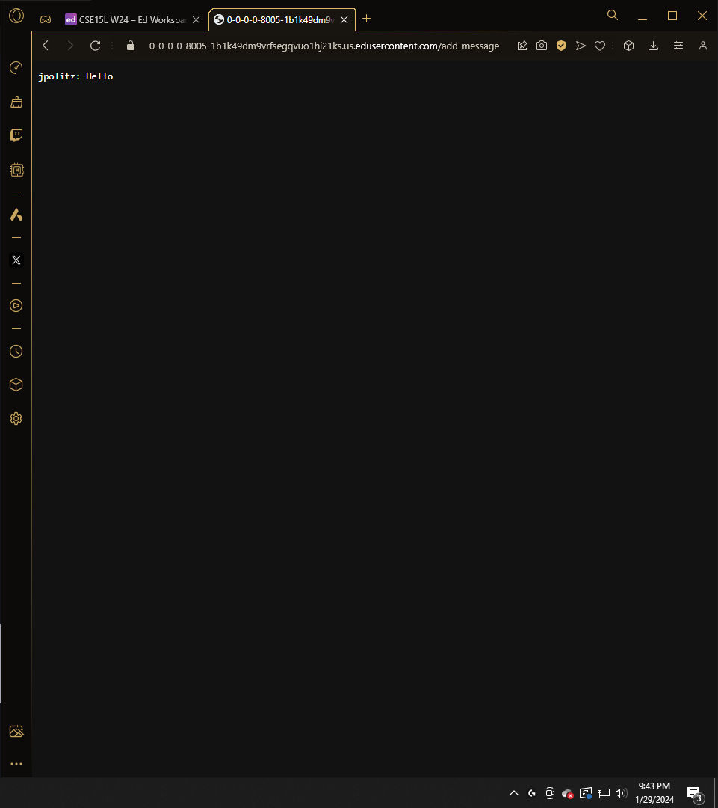
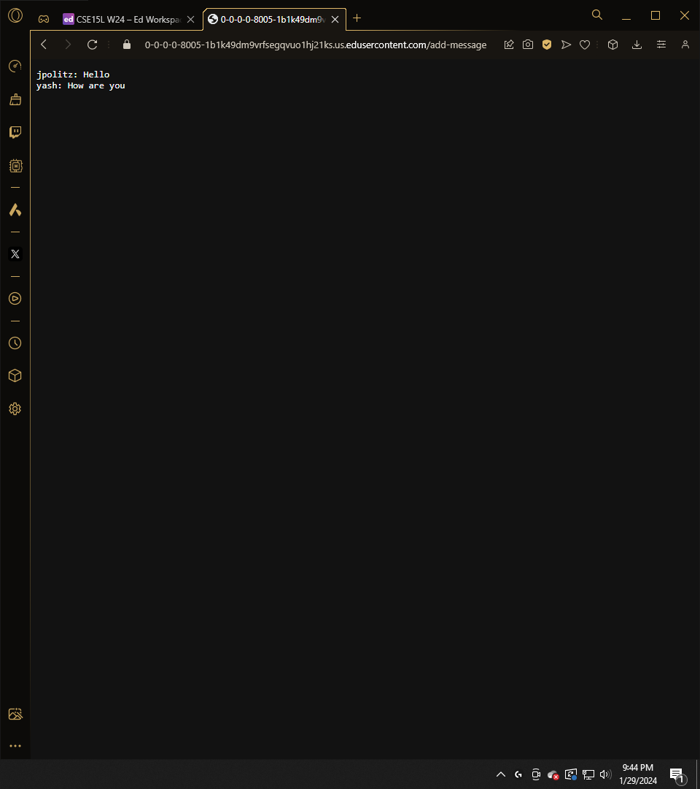
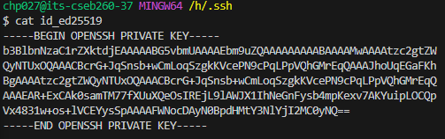
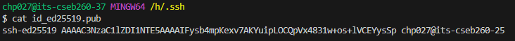

## Lab Report 2

# Part 1

This code is my attempt at a general solution so calling methods wold actually apply to all of them.
The URI handler takes the url and directs the user to a chat room when they input a new message. Otherwise the user is directed to a 404 error code. 

This is the first instance of the chat room being used and all it does is add the message to an arraylist and then the arraylist is printed out into the website for the user to see. It splits the url to get the user and the message and formats it into a readable format for the user to see. These splits are put into `String[]` parameters and then get properly sorted into relevant variables `String` Name and `String` Message. Message is then cut down to remove everything after the ampersand and split into a `String[]` Messagelog variable to separate spaces. In this case there was no spaces so Messagelog was only 1 in length. Then the message was reconstructed with spaces for easier reading. It is then added to and `Arraylist<String>` chatlog which keeps a record of the conversations and messages that came before it. Then a new `String` called output, copies the chatlog and returns it in a more readable format.

Almost identical to the previous image, but the `String[]` Messagelog has multiple inputs now and reconstructed which effectively replaced the plus signs with spaces.
# Part 2
Private Key:

Public Key:

# Part 3

Setting up a server was more tedious than I remember, but learning where the public and private key was in the system was a cool experience to have. I also remembered the pain of using regex with some particular symbols (+). THis lab was also a wake up call to touch up on the basics of Java again, because of the many easy mistakes I made on this particular coding project.
