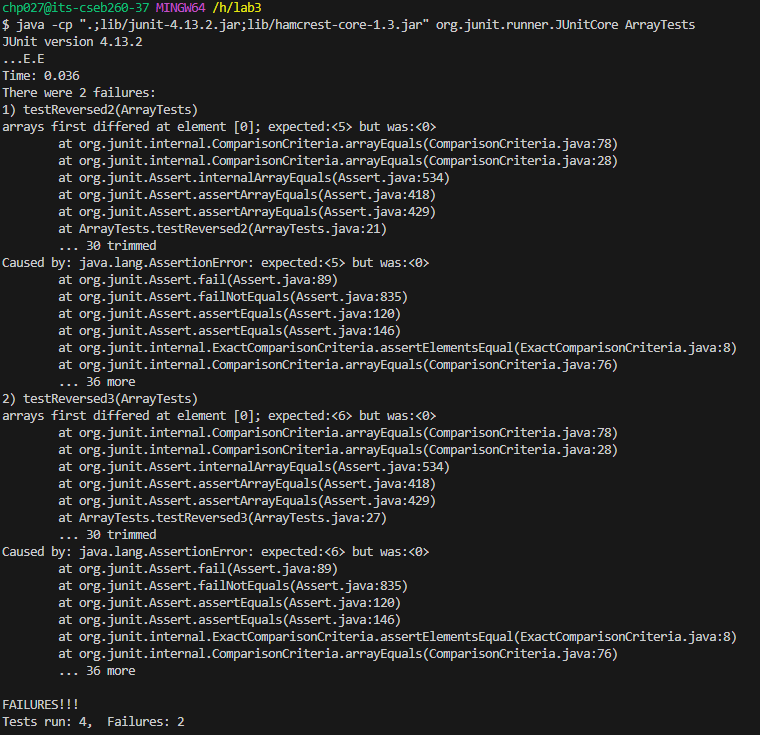
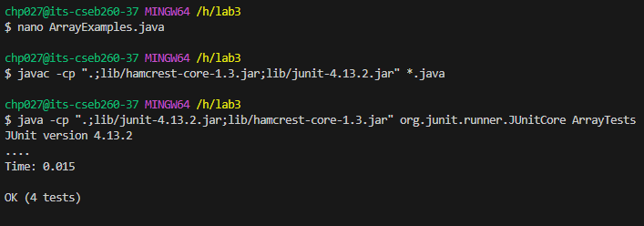

## Lab Report 3

# Part 1
Bug: Reversed Array
Code: Array Example
`public class ArrayExamples {

  // Changes the input array to be in reversed order
  static void reverseInPlace(int[] arr) {
    for(int i = 0; i < arr.length; i += 1) {
      arr[i] = arr[arr.length - i - 1];
    }
  }

  // Returns a *new* array with all the elements of the input array in reversed
  // order
  static int[] reversed(int[] arr) {
    int[] newArray = new int[arr.length];
    for(int i = 0; i < arr.length; i += 1) {
      arr[i] = newArray[arr.length - i - 1];
    }
    return arr;
  }

  // Averages the numbers in the array (takes the mean), but leaves out the
  // lowest number when calculating. Returns 0 if there are no elements or just
  // 1 element in the array
  static double averageWithoutLowest(double[] arr) {
    if(arr.length < 2) { return 0.0; }
    double lowest = arr[0];
    for(double num: arr) {
      if(num < lowest) { lowest = num; }
    }
    double sum = 0;
    for(double num: arr) {
      if(num != lowest) { sum += num; }
    }
    return sum / (arr.length - 1);
  }
}`

`@Test
  public void testReversed2() {
    int[] input1 = { 1, 3, 2, 5 };
    assertArrayEquals(new int[]{ 5, 2, 3, 1 }, ArrayExamples.reversed(input1));      
  }

  @Test
  public void testReversed3() {
    int[] input1 = { 1, 2, 3, 4, 5, 6 };
    assertArrayEquals(new int[]{ 6, 5, 4, 3, 2, 1 }, ArrayExamples.reversed(input1));
  }`

The Symptom: 

The Bug:
`// Returns a *new* array with all the elements of the input array in reversed
  // order
  static int[] reversed(int[] arr) {
    int[] newArray = new int[arr.length];
    for(int i = 0; i < arr.length; i += 1) {
      arr[i] = newArray[arr.length - i - 1];
    }
    return arr;
  }`
 
The fixed solution:
`// Returns a *new* array with all the elements of the input array in reversed
  // order
  static int[] reversed(int[] arr) {
    int[] newArray = new int[arr.length];
    for(int i = 0; i < arr.length; i += 1) {
      newArray[i] = arr[arr.length - i - 1];
    }
    return newArray;
  }`

  The correct output:
  
# Part 2

