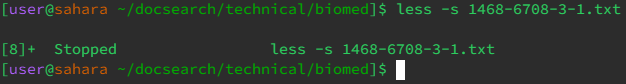
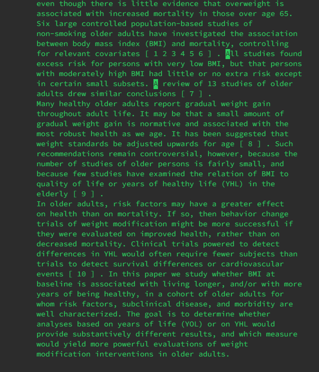
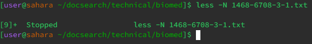
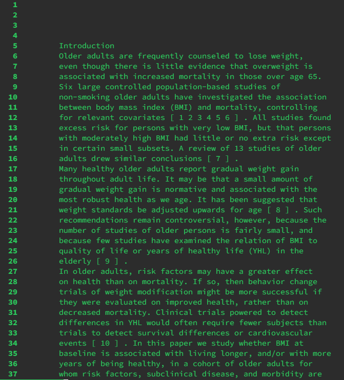

## Lab Report 3


# Part 1
Bug: Reversed Array
Code: Array Example
<br>
`````````````````
public class ArrayExamples {
  // Changes the input array to be in reversed order `
  static void reverseInPlace(int[] arr) {
    for(int i = 0; i < arr.length; i += 1) {
      arr[i] = arr[arr.length - i - 1];
    }
  }

  // Returns a *new* array with all the elements of the input array in reversed
  // order
  static int[] reversed(int[] arr) {
    int[] newArray = new int[arr.length];
    for(int i = 0; i < arr.length; i += 1) {
      arr[i] = newArray[arr.length - i - 1];
    }
    return arr;
  }
`````````````````

<br>
The new tests
<br>

```````````
  @Test
  public void testReversed2() {
    int[] input1 = { 1, 3, 2, 5 };
    assertArrayEquals(new int[]{ 5, 2, 3, 1 }, ArrayExamples.reversed(input1));
  }`

  @Test
  public void testReversed3() {
    int[] input1 = { 1, 2, 3, 4, 5, 6 };
    assertArrayEquals(new int[]{ 6, 5, 4, 3, 2, 1 }, ArrayExamples.reversed(input1));
  }
```````````

<br>
The Symptom:
<br>


<br>
The Bug: 
<br>

`````````
 // Returns a *new* array with all the elements of the input array in reversed
 // order
  static int[] reversed(int[] arr) {
    int[] newArray = new int[arr.length];
    for(int i = 0; i < arr.length; i += 1) {
      arr[i] = newArray[arr.length - i - 1];
    }
    return arr;
  }
`````````
<br>
The fixed solution: 
<br>

`````````
// Returns a *new* array with all the elements of the input array in reversed
// order
  static int[] reversed(int[] arr) {
    int[] newArray = new int[arr.length];
    for(int i = 0; i < arr.length; i += 1) {
      newArray[i] = arr[arr.length - i - 1];
    }
    return newArray;
  }`
`````````

<br>
The correct output:
<br>


<br>

# Part 2

Less <br>
https://en.wikipedia.org/wiki/Less_(Unix)#:~:text=less%20is%20a%20terminal%20pager,backward%20navigation%20through%20the%20file.
<br>
Searches and displays a file 1 screen at a time
<br>
-i
<br>
Similar to ctrl f on google, it is a case-insensitive search
<br>
<br>
launching the command<br>
<br>
using the search feature to find all regardless of case<br>

-m
<br>
provides more details, such as file position 
<br>
<br>
Launching the command<br>
<br>


-S
<br>
prevents lines from being tabbed automatically when exceeding the character limit. 
<br>
<br>
Launching the command<br>
<br>
This file is tabbed manually so it doesn't overflow past the screen<br>
<br>
This is to show that you can scroll sideways<br>

-N
<br>
Gives line numbers
<br>
<br>
Launching the command<br>
<br>
This file now has the line number on the side.


