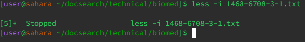
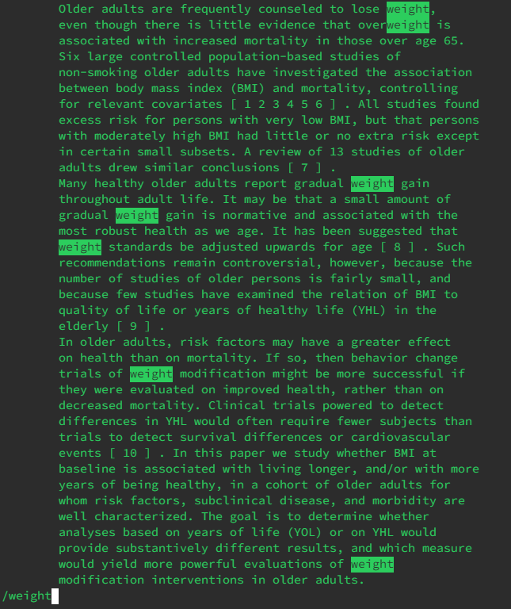
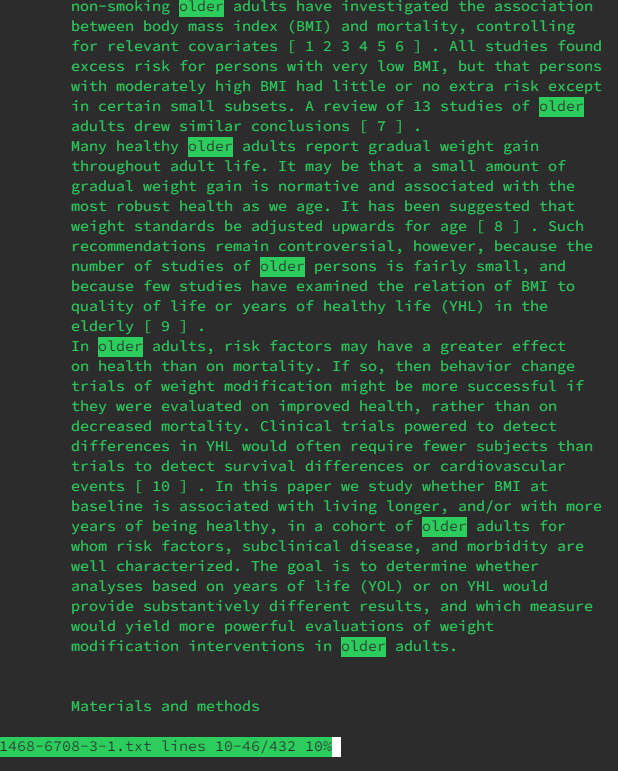

## Lab Report 3

# Part 1
Bug: Reversed Array
Code: Array Example
 
`public class ArrayExamples {`
`  // Changes the input array to be in reversed order `  
`  static void reverseInPlace(int[] arr) {`  
`    for(int i = 0; i < arr.length; i += 1) {`  
`      arr[i] = arr[arr.length - i - 1]; `  
`    }`  
`  }`

`  // Returns a *new* array with all the elements of the input array in reversed`  
`  // order`  
`  static int[] reversed(int[] arr) {`  
`    int[] newArray = new int[arr.length];`  
`    for(int i = 0; i < arr.length; i += 1) {`  
`      arr[i] = newArray[arr.length - i - 1];`  
`    }`  
`    return arr;`  
`  }`

`  // Averages the numbers in the array (takes the mean), but leaves out the`  
`  // lowest number when calculating. Returns 0 if there are no elements or just`  
`  // 1 element in the array`  
`  static double averageWithoutLowest(double[] arr) {`  
`    if(arr.length < 2) { return 0.0; }` 
`    double lowest = arr[0];` 
`    for(double num: arr) {` 
`      if(num < lowest) { lowest = num; }` 
`    }` 
`    double sum = 0;` 
`    for(double num: arr) {` 
`      if(num != lowest) { sum += num; }` 
`    }` 
`    return sum / (arr.length - 1);` 
`  }` 
`}` 

`  @Test` 
`  public void testReversed2() {` 
`    int[] input1 = { 1, 3, 2, 5 };` 
`    assertArrayEquals(new int[]{ 5, 2, 3, 1 }, ArrayExamples.reversed(input1));` 
`  }`

`  @Test` 
`  public void testReversed3() {` 
`    int[] input1 = { 1, 2, 3, 4, 5, 6 };` 
`    assertArrayEquals(new int[]{ 6, 5, 4, 3, 2, 1 }, ArrayExamples.reversed(input1));` 
`  }`

The Symptom: 

The Bug:  
` // Returns a *new* array with all the elements of the input array in reversed` 
` // order` 
`  static int[] reversed(int[] arr) {` 
`    int[] newArray = new int[arr.length];` 
`    for(int i = 0; i < arr.length; i += 1) {` 
`      arr[i] = newArray[arr.length - i - 1];` 
`    }` 
`    return arr;` 
`  }`
 
The fixed solution:  
`// Returns a *new* array with all the elements of the input array in reversed` 
`// order` 
`  static int[] reversed(int[] arr) {` 
`    int[] newArray = new int[arr.length];` 
`    for(int i = 0; i < arr.length; i += 1) {` 
`      newArray[i] = arr[arr.length - i - 1];` 
`    }` 
`    return newArray;` 
`  }` 

  The correct output:
  
# Part 2

Less  
https://en.wikipedia.org/wiki/Less_(Unix)#:~:text=less%20is%20a%20terminal%20pager,backward%20navigation%20through%20the%20file.
 
Searches and displays a file 1 screen at a time
 
-i
 
Similar to ctrl f on google, it is a case-insensitive search
 
 
launching the command 
 
using the search feature to find all regardless of case 

-m
 
provides more details, such as file position 
 
 
Launching the command 
 

-S
 
prevents lines from being tabbed automatically when exceeding the character limit. 
 
 
Launching the command 
 
This file is tabbed manually so it doesn't overflow past the screen 
 
This is to show that you can scroll sideways 

-N
 
Gives line numbers
 
 
Launching the command 
 
This file now has the line number on the side.

