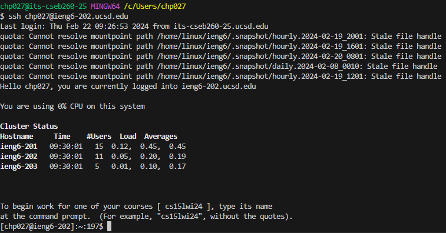

## Lab Report 4

 

`<UP>, <UP>, <UP>, <UP>, <UP>, <ENTER>`: Due to me using this command before, the line to log into the virtual machine was already saved in the command history. The command executed was a login command `ssh chp027@ieng6-202.ucsd.edu`. The command was 5 up in the search history, so I hit up key 5 times and pressed enter to execute it.

 

 

`<UP>, <UP>, <UP>, <UP>, <UP>, <ENTER>`: Similarly to the previous example this command was also saved in the command history. I hit the up key 5 times to get the command `git clone git@github.com:phanc2069/lab7Forked.git`, which looks at the link and clones the repository into the awd. Just like before, I hit the up key 5 times and pressed enter to execute it.

 

 

`<c>, <d>, <SPACE>, <l>, <a>, <b>, <7>, <SHIFT+f>, <TAB>, <ENTER>`: I pushed the keys in so I could change the awd to the directory that I just cloned (lab7Forked/). The tab was to autofill the rest of the directory name. The command is `cd lab7Forked/`. Yes it would of been faster to go into the command history according to the number of keys, but this was just muscle memory jumping in.

 

 

`<UP>, <UP>, <UP>, <UP>, <UP>, <ENTER>`: The command `bash test.sh` executes the .sh file inside the copied repository. The test file was compile the junit test and run the junit test. I accessed this command from the command history by hitting the up key 5 times. As expected the tests failed.

 

 

`<UP>, <UP>, <UP>, <UP>, <UP>, <ENTER>`: The command `vim ListExamples.java` opens the file in the command line and allows you to view and edit it. Just like others before, the command was saved on the command history and was accessed by pressing the up key 5 times. 

 

 

`<SHIFT+g>, <6>, <k>, <1>, <e>, <r>, <2>`: This sequences goes to the bottom of the page, jumps up 6 lines, moves to the end of the first word, and replaces the last character with a 2.

 

 

`<:>, <w>, <q>, <ENTER>, <up>, <up>, <ENTER>`: The command `:wq` saves the file and exits vim. The next set of commands goes up 2 in the command history and the enter key executes it. The command that was executed was `bash test.sh` which was the command that compiled and executed the junit tests.

 

 

`<UP>, <UP>, <ENTER>`: The command `bash test.sh` executes the .sh file inside the copied repository. The test file was compile the junit test and run the junit test. I accessed this command from the command history by hitting the up key twice. As expected the tests succeeded.

 

 

`<g>, <i>, <t>, <SPACE>, <a>, <d>, <d>, <SPACE>, <.>, <ENTER>`: The command `git add .` preps the all files to be committed to the main branch. 

 

`<g>, <i>, <t>, <SPACE>, <c>, <o>, <m>, <m>, <i>, <t>, <SPACE>, <->, <m>, <SPACE>, <">, <f>, <i>, <x>, <e>, <d>, <">, <ENTER>`: The command `git commit -m "fixed"` relays a message on what was changed so others can get an idea of what was changed

 

`<g>, <i>, <t>, <SPACE>, 
, <u>, <s>, <h>, <ENTER>`: The command `git push` pushes the change to the main repository which we can see on github.
