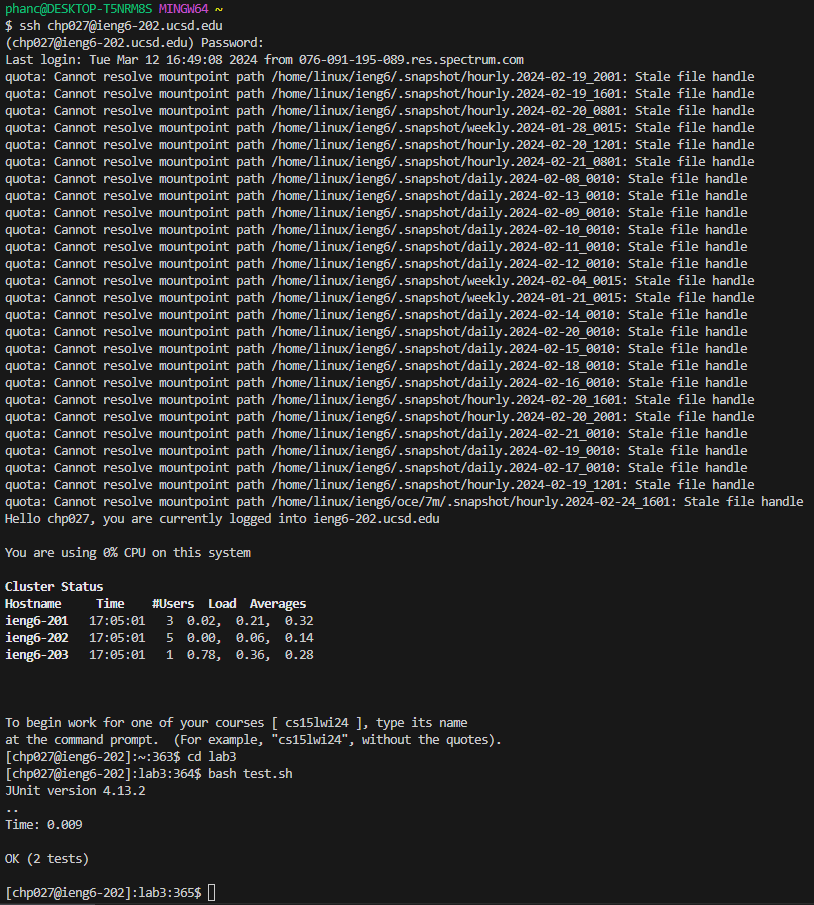

## Lab Report 5
# Part 1

Chris: While working on lab 4, I ran into an interesting error after executing the bash file:


<br>


<br>

This error seems to be that the virtual machine doesn't recognize junit as a valid library? You can see me trying to compile the file manually under it but it also fails to compile. The bash script was not modified by me as I grabbed it straight from the repo provided But since I don't have any admin privileges to the VM, I can't come up with a solution to this issue. 

<br>
Here is the set up of the directory:

````````
ieng6-203
  lab3
    ArrayExamples.java
    ArrayTests.java
    test.sh
    lib
      hamcrest-core-1.3.jar
      junit-4.13.2.jar
````````
This is the contents of the files:
<br>
ArrayExamples.java <br>
 <br>
ArrayTests.java <br>
 <br>
test.sh <br>


TA: This error is weird, but I happened to run into it before. Can you tell me how you logged in to the VM?

<br>

Chris: My username plus the `@ieng6.ucsd.edu`, just like the teacher described it in class.

<br>

TA: Well, the issue is that the VM you logged into is the one that doesn't have java installed in it for some reason, you can see after the ieng: the number that follows it. That server doesn't have java in it. So log out and log in the same way but after `ieng6`, put `-202` instead. That server should have java installed.

<br>

Chris: That seemed to solve the issue! What a weird quirk. Thanks for your help!



<br>

# Part 2

Back when I took a similar class in highschool, I learned about VIM, but was relegated to learning NANO instead. I definitely prefer using VIM even though I put more time into NANO. Getting good with VIM reminds me of my CS friends and how they are so efficient with commands and how they run linux as their OS. Learning VIM was like looking through those old cheat codes forums online and feeling like some member of a secret society with the forbidden knowledge to destabilize society (lol). 
